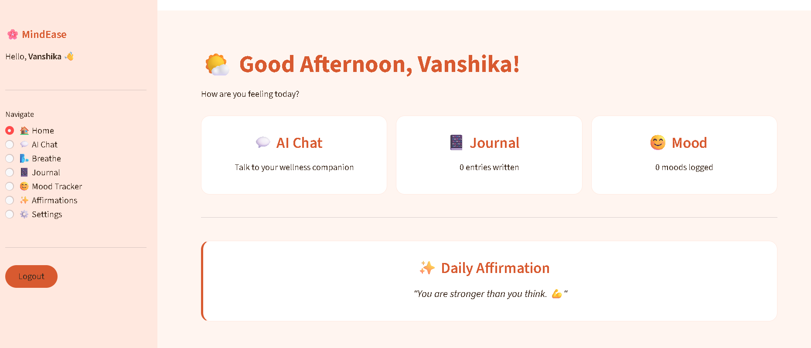

# 🌸 MindEase - AI Mental Wellness App

> Your personal mental wellness companion powered by AI


---

## ✨ Features

- 💬 **AI Chat** — Talk to a warm AI wellness companion (Gemini API)
- 🌬️ **Breathing Exercise** — Guided breathing techniques for stress relief
- 📔 **Journal** — Write your thoughts in a safe space
- 😊 **Mood Tracker** — Track your daily mood with graphs
- ✨ **Affirmations** — Daily positive affirmations
- 🌸 **Light/Dark Theme** — Soothing warm UI

---

## 🚀 How to Run

1. Clone the repository
```bash
git clone https://github.com/vanshika-aggarwal31/mindease-wellness-app.git
cd mindease-wellness-app
```

2. Install dependencies
```bash
pip install streamlit google-generativeai
```

3. Add your Gemini API key in `app.py`

4. Run the app
```bash
streamlit run app.py
```

---

## 📸 Screenshots

### 🏠 Home Dashboard



---

## 🛠️ Tech Stack

| Technology | Purpose |
|------------|---------|
| Python | Core language |
| Streamlit | Frontend UI |
| Google Gemini API | AI chat responses |
| Pandas | Mood data tracking |

---

## 💙 About

Built with love for everyone who needs a gentle space to breathe, reflect, and feel heard.

> *"Your feelings are valid. You are not alone."* 🌸

---

## 👩‍💻 Developer

**Vanshika Aggarwal**
[](https://www.linkedin.com/in/vanshika-aggarwal31)
[](https://github.com/vanshika-aggarwal31)